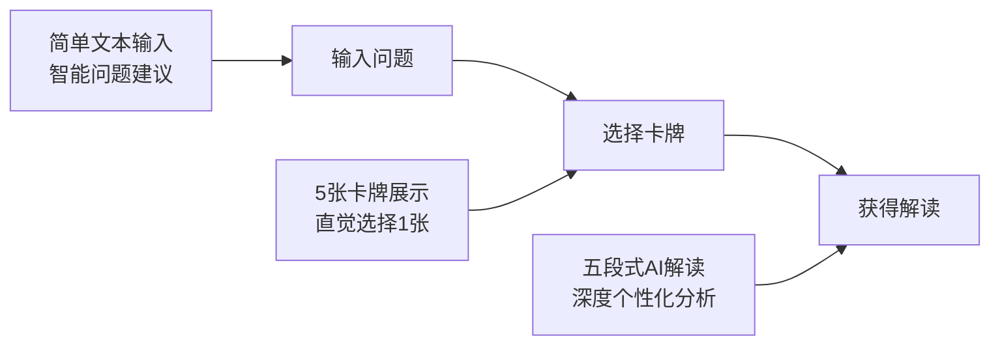
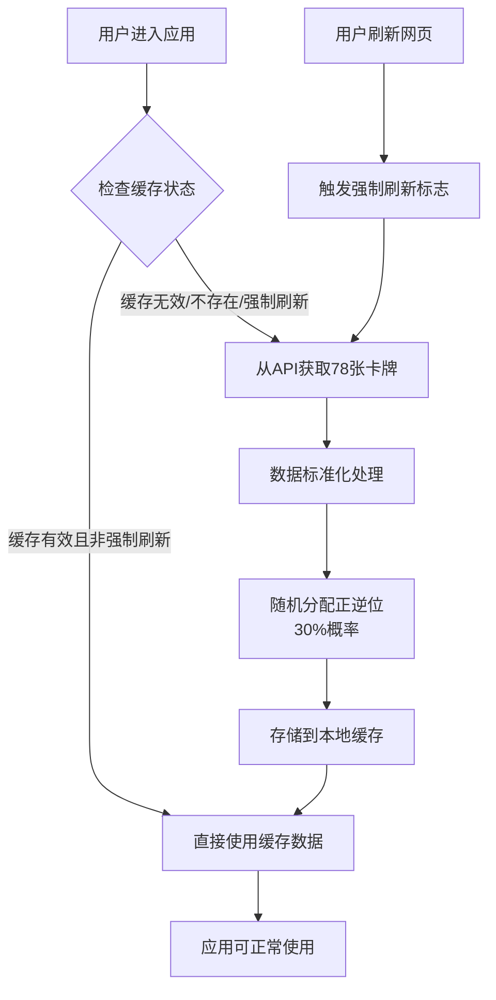
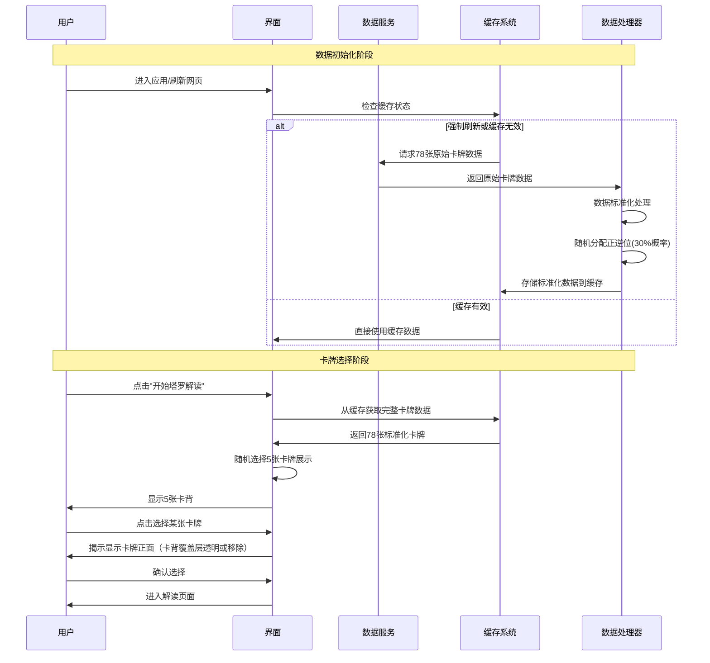
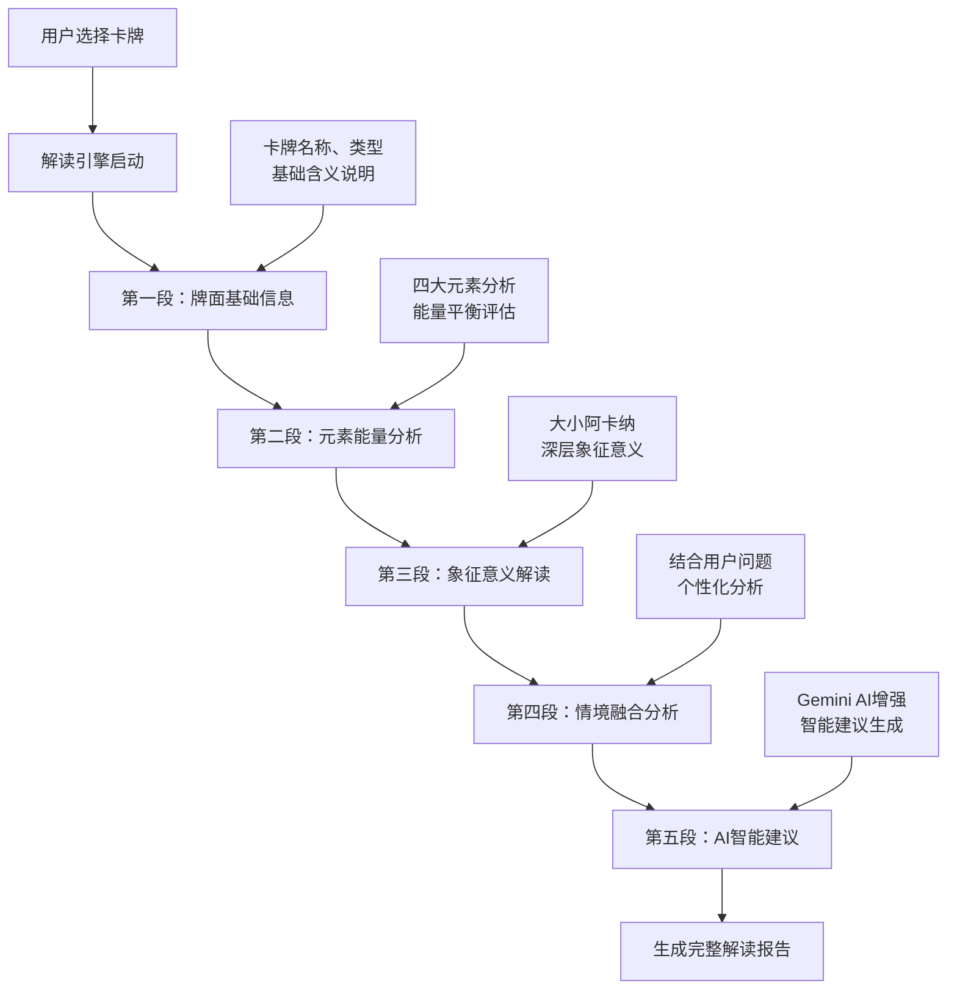
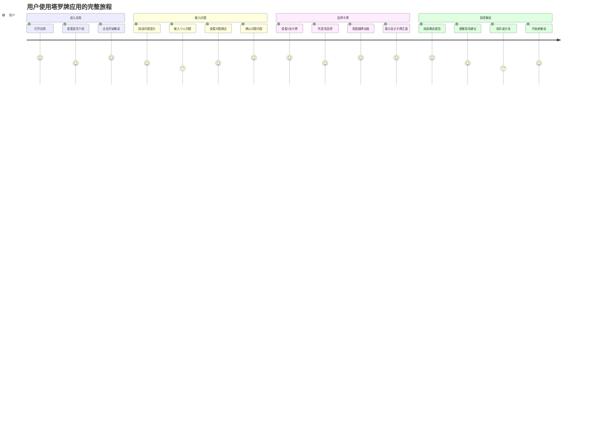
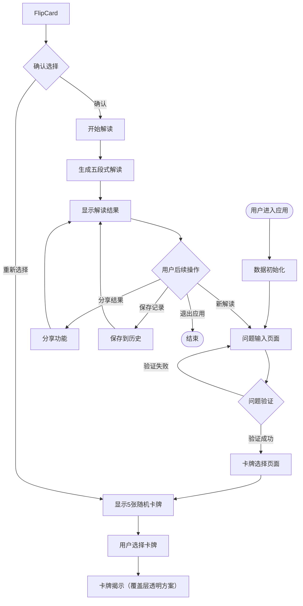
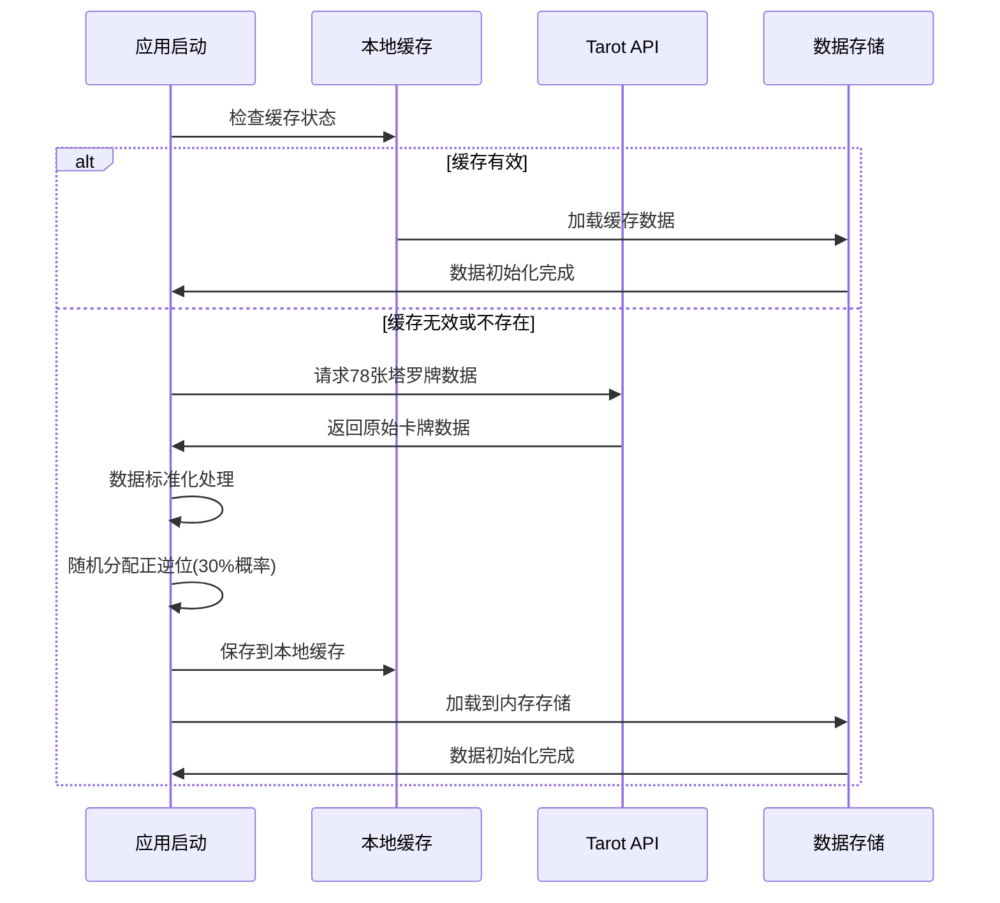
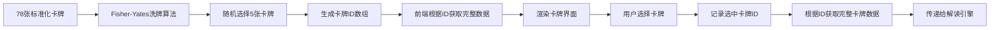
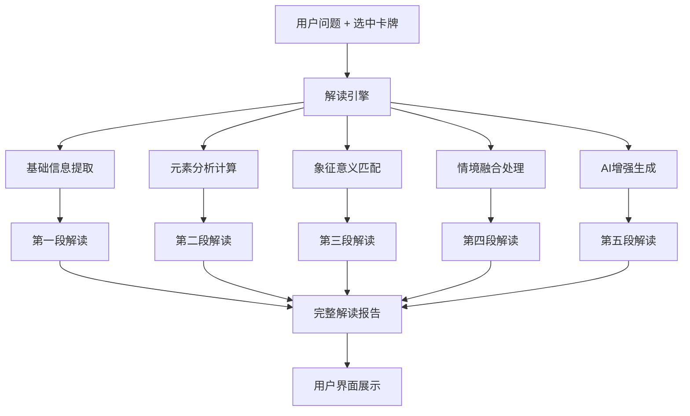

# 塔罗牌应用产品规划文档

**文档版本**: v2.0.0  
**创建日期**: 2025年1月17日  
**产品定位**: 简化版智能塔罗牌解读应用  
**目标用户**: 塔罗牌爱好者、心理咨询需求用户、精神探索者  

---

## 📋 产品概述

### 产品愿景
打造一款**极简、智能、专业**的塔罗牌解读应用，让用户通过简单的问题输入，即可获得深度的塔罗牌指引和AI增强解读，降低塔罗牌的使用门槛，提升用户的精神探索体验。

### 核心价值主张
- **极简交互**: 只需输入问题，无需复杂的牌阵选择
- **智能解读**: AI增强的五段式专业解读系统
- **即时体验**: 快速响应，流畅的卡牌选择体验
- **专业品质**: 基于传统塔罗牌理论的现代化实现

### 产品定位
**简化版智能塔罗牌解读应用** - 专注于单牌深度解读，通过AI技术提供个性化的塔罗牌指引服务。

---

## 🎯 设计理念与核心思路

### 1. 极简主义设计理念

#### 1.1 "Less is More" 原则
- **简化用户决策**: 移除复杂的牌阵选择，专注于问题本身
- **减少认知负担**: 统一使用5牌阵，用户只需选择1张牌
- **提升专注度**: 让用户将注意力集中在问题思考和卡牌感知上

#### 1.2 渐进式信息披露


### 2. 数据驱动的产品设计

#### 2.1 统一数据源策略
- **单一真实来源**: 所有卡牌数据来自统一的缓存系统
- **预处理机制**: 在用户进入应用时完成所有数据标准化
- **一致性保证**: 确保用户看到的卡牌与AI解读的卡牌完全一致

#### 2.2 智能缓存机制


#### 2.3 强制刷新机制
- **触发条件**: 用户刷新网页（F5或Ctrl+R）
- **处理逻辑**: 忽略现有缓存，强制从API重新获取数据
- **数据处理**: 完整执行数据标准化和正逆位随机赋值流程
- **用户体验**: 显示"正在更新卡牌数据..."的加载提示

### 3. 用户体验优先原则

#### 3.1 零学习成本
- **直觉操作**: 无需了解塔罗牌知识即可使用
- **智能引导**: 提供问题模板和操作提示
- **即时反馈**: 每个操作都有明确的视觉反馈

#### 3.2 情感化设计
- **神秘氛围**: 深紫色主题营造神秘感
- **仪式感**: 卡牌揭示（RevealCard）增强仪式体验（采用卡背覆盖层透明方案，非3D翻转）
- **个性化**: AI解读结合用户问题提供个性化内容

---

## 🎨 UI设计风格规范

### 1. 现代卡片式设计语言

#### 1.1 设计核念
- **现代卡片式布局**: 采用Material Design 3.0卡片设计语言，营造层次感和空间感
- **简洁美观大方**: 遵循极简主义原则，去除冗余装饰，突出核心功能
- **神秘感营造**: 通过配色、动效、图标等元素体现塔罗牌的神秘氛围
- **情感化设计**: 注重用户情感体验，营造仪式感与专业感

#### 1.2 视觉层次体系
```css
/* 卡片层次设计 */
.card-elevation-system {
  /* 基础卡片 - 内容展示 */
  --card-elevation-1: 0 1px 3px rgba(0,0,0,0.12), 0 1px 2px rgba(0,0,0,0.24);
  
  /* 交互卡片 - 可点击元素 */
  --card-elevation-2: 0 3px 6px rgba(0,0,0,0.16), 0 3px 6px rgba(0,0,0,0.23);
  
  /* 悬浮卡片 - hover状态 */
  --card-elevation-3: 0 10px 20px rgba(0,0,0,0.19), 0 6px 6px rgba(0,0,0,0.23);
  
  /* 模态卡片 - 弹窗和重要内容 */
  --card-elevation-4: 0 14px 28px rgba(0,0,0,0.25), 0 10px 10px rgba(0,0,0,0.22);
  
  /* 塔罗牌卡片 - 特殊神秘效果 */
  --tarot-card-glow: 0 0 20px rgba(138, 43, 226, 0.3), 0 0 40px rgba(138, 43, 226, 0.1);
}
```

### 2. 神秘主义配色方案

#### 2.1 主色调系统
```css
/* 神秘紫色主题 */
:root {
  /* 主色调 - 深邃神秘紫 */
  --primary-color: #8A2BE2;        /* 蓝紫色 - 主要品牌色 */
  --primary-dark: #6A1B9A;         /* 深紫色 - 强调色 */
  --primary-light: #BA68C8;        /* 浅紫色 - 辅助色 */
  
  /* 辅助色调 - 神秘金色 */
  --accent-color: #FFD700;         /* 金色 - 点缀色 */
  --accent-dark: #FFA000;          /* 深金色 - 强调金色 */
  --accent-light: #FFF59D;         /* 浅金色 - 背景金色 */
  
  /* 中性色调 - 优雅灰度 */
  --neutral-900: #1A1A2E;          /* 深夜蓝 - 主要文字 */
  --neutral-700: #16213E;          /* 暗蓝灰 - 次要文字 */
  --neutral-500: #0F3460;          /* 中蓝灰 - 辅助文字 */
  --neutral-300: #E53E3E;          /* 浅灰 - 边框线条 */
  --neutral-100: #F7FAFC;          /* 极浅灰 - 背景色 */
  --neutral-50: #FFFFFF;           /* 纯白 - 卡片背景 */
  
  /* 功能色调 */
  --success-color: #48BB78;        /* 成功绿 */
  --warning-color: #ED8936;        /* 警告橙 */
  --error-color: #F56565;          /* 错误红 */
  --info-color: #4299E1;           /* 信息蓝 */
}
```

#### 2.2 渐变效果系统
```css
/* 神秘渐变背景 */
.gradient-backgrounds {
  /* 主背景渐变 - 深邃星空 */
  --bg-primary: linear-gradient(135deg, #1A1A2E 0%, #16213E 50%, #0F3460 100%);
  
  /* 卡片背景渐变 - 柔和紫光 */
  --bg-card: linear-gradient(145deg, rgba(138, 43, 226, 0.05) 0%, rgba(186, 104, 200, 0.03) 100%);
  
  /* 按钮渐变 - 神秘紫金 */
  --bg-button: linear-gradient(135deg, #8A2BE2 0%, #BA68C8 100%);
  
  /* 塔罗牌背面渐变 - 星空神秘 */
  --bg-tarot-back: radial-gradient(circle at center, #6A1B9A 0%, #1A1A2E 70%, #000000 100%);
}
```

### 3. 塔罗牌卡片设计规范

#### 3.1 卡片尺寸标准
```css
/* 塔罗牌卡片尺寸系统 */
.tarot-card-sizes {
  /* 标准塔罗牌比例 - 2.75:4.75 (约1:1.73) */
  --card-width-sm: 120px;          /* 小尺寸 - 缩略图 */
  --card-height-sm: 207px;
  
  --card-width-md: 180px;          /* 中尺寸 - 选择界面 */
  --card-height-md: 311px;
  
  --card-width-lg: 240px;          /* 大尺寸 - 解读展示 */
  --card-height-lg: 415px;
  
  --card-width-xl: 320px;          /* 超大尺寸 - 详细查看 */
  --card-height-xl: 553px;
}
```

#### 3.2 卡片交互效果
```css
/* 塔罗牌交互动效（揭示/Overlay-first） */
.tarot-card {
  transition: opacity 220ms ease, transform 220ms ease, box-shadow 220ms ease;
  cursor: pointer;
}

/* 覆盖层（卡背）优先渲染：初始为不透明，承载点击与键盘焦点 */
.tarot-card__overlay {
  position: absolute;
  inset: 0;
  background: var(--bg-tarot-back);
  display: grid;
  place-items: center;
  border-radius: 12px;
  box-shadow: var(--card-elevation-2);
  opacity: 1;          /* 初始不透明：不可见正面 */
  pointer-events: auto; /* 承载交互 */
}

/* 揭示交互：在用户触发后，覆盖层淡出为透明，正面随之显现 */
.tarot-card--revealed .tarot-card__overlay {
  opacity: 0;
  transition: opacity 240ms ease;
}

/* 正面图层：仅在揭示后可见，加载前使用占位/骨架 */
.tarot-card__face {
  position: absolute;
  inset: 0;
  border-radius: 12px;
  background-size: cover;
  background-position: center;
  opacity: 0; /* 初始不可见，避免提前暴露 */
}

/* 当真实图像已加载且状态为已揭示时，正面淡入 */
.tarot-card--revealed .tarot-card__face.is-ready {
  opacity: 1;
  transition: opacity 260ms ease;
}

/* 悬浮与选中轻动效（非 3D 翻转） */
.tarot-card:hover { transform: translateY(-6px) scale(1.01); box-shadow: var(--card-elevation-3); }
.tarot-card.is-selected { transform: translateY(-10px) scale(1.03); box-shadow: 0 0 30px rgba(255, 215, 0, 0.35); }
```

可访问性（A11y）要求：
- 可聚焦：覆盖层元素带有 tabindex=0，支持键盘导航
- 语义：按钮/可交互区域应声明 role="button"，并在揭示后设置 aria-pressed="true"
- 键盘交互：Enter/Space 触发揭示；Esc 可取消选中（如适用）
- 屏幕阅读：为每张卡提供 aria-label（如“第 N 张卡，未揭示/已揭示”），揭示后通过 aria-live=polite 宣告状态变化
- 版本规划：v1 暂不支持在 CardGrid 网格中使用方向键（ArrowUp/Down/Left/Right）在卡片间移动焦点，待后续版本评估需求与实现方案后纳入

验收要点（不提前暴露红线）：
- 在弱网或图片未加载完成前，正面图层保持 opacity: 0，不可通过任何路径看到卡面
- 覆盖层必须优先渲染且承载首个交互事件；揭示后淡出，不得出现 3D 翻转
- 设计与实现中的任意动画均不得泄露卡面细节（包括子像素缝隙、过渡伪影）

### 4. 字体排版系统


#### 4.1 字体层级定义
```css
/* 字体系统 - 优雅可读 */
:root {
  /* 主字体 - 现代无衬线 */
  --font-primary: 'Inter', 'SF Pro Display', -apple-system, BlinkMacSystemFont, sans-serif;
  
  /* 装饰字体 - 神秘感标题 */
  --font-decorative: 'Playfair Display', 'Times New Roman', serif;
  
  /* 等宽字体 - 代码和数据 */
  --font-mono: 'JetBrains Mono', 'Monaco', 'Consolas', monospace;
}

/* 字体大小系统 */
.typography-scale {
  --text-xs: 0.75rem;      /* 12px - 辅助信息 */
  --text-sm: 0.875rem;     /* 14px - 次要文字 */
  --text-base: 1rem;       /* 16px - 正文 */
  --text-lg: 1.125rem;     /* 18px - 重要文字 */
  --text-xl: 1.25rem;      /* 20px - 小标题 */
  --text-2xl: 1.5rem;      /* 24px - 中标题 */
  --text-3xl: 1.875rem;    /* 30px - 大标题 */
  --text-4xl: 2.25rem;     /* 36px - 主标题 */
  --text-5xl: 3rem;        /* 48px - 超大标题 */
}
```

#### 4.2 文字层次应用
```css
/* 标题系统 */
.heading-primary {
  font-family: var(--font-decorative);
  font-size: var(--text-4xl);
  font-weight: 700;
  color: var(--primary-color);
  text-align: center;
  margin-bottom: 2rem;
}

.heading-secondary {
  font-family: var(--font-primary);
  font-size: var(--text-2xl);
  font-weight: 600;
  color: var(--neutral-900);
  margin-bottom: 1.5rem;
}

/* 正文系统 */
.body-text {
  font-family: var(--font-primary);
  font-size: var(--text-base);
  line-height: 1.6;
  color: var(--neutral-700);
}

.body-text-large {
  font-size: var(--text-lg);
  line-height: 1.5;
  color: var(--neutral-900);
}
```

### 5. 组件设计规范

#### 5.1 按钮设计系统
```css
/* 按钮基础样式 */
.btn-base {
  padding: 0.75rem 1.5rem;
  border-radius: 0.5rem;
  font-family: var(--font-primary);
  font-weight: 500;
  font-size: var(--text-base);
  transition: all 0.2s ease;
  cursor: pointer;
  border: none;
  outline: none;
}

/* 主要按钮 - 神秘紫色 */
.btn-primary {
  background: var(--bg-button);
  color: white;
  box-shadow: var(--card-elevation-2);
  
  &:hover {
    transform: translateY(-2px);
    box-shadow: var(--card-elevation-3);
  }
}

/* 次要按钮 - 优雅边框 */
.btn-secondary {
  background: transparent;
  color: var(--primary-color);
  border: 2px solid var(--primary-color);
  
  &:hover {
    background: var(--primary-color);
    color: white;
  }
}
```

#### 5.2 输入框设计
```css
/* 输入框样式 */
.input-field {
  width: 100%;
  padding: 1rem 1.25rem;
  border: 2px solid var(--neutral-300);
  border-radius: 0.75rem;
  font-family: var(--font-primary);
  font-size: var(--text-base);
  background: var(--neutral-50);
  transition: all 0.2s ease;
  
  &:focus {
    border-color: var(--primary-color);
    box-shadow: 0 0 0 3px rgba(138, 43, 226, 0.1);
    outline: none;
  }
  
  &::placeholder {
    color: var(--neutral-500);
    font-style: italic;
  }
}
```

### 6. 响应式设计规范

#### 6.1 断点系统
```css
/* 响应式断点 */
:root {
  --breakpoint-sm: 640px;   /* 手机横屏 */
  --breakpoint-md: 768px;   /* 平板竖屏 */
  --breakpoint-lg: 1024px;  /* 平板横屏/小笔记本 */
  --breakpoint-xl: 1280px;  /* 桌面显示器 */
  --breakpoint-2xl: 1536px; /* 大屏显示器 */
}

/* 移动优先响应式设计 */
@media (max-width: 768px) {
  .tarot-card {
    width: var(--card-width-sm);
    height: var(--card-height-sm);
  }
  
  .card-grid {
    grid-template-columns: repeat(2, 1fr);
    gap: 1rem;
  }
}

@media (min-width: 769px) and (max-width: 1024px) {
  .tarot-card {
    width: var(--card-width-md);
    height: var(--card-height-md);
  }
  
  .card-grid {
    grid-template-columns: repeat(3, 1fr);
    gap: 1.5rem;
  }
}

@media (min-width: 1025px) {
  .tarot-card {
    width: var(--card-width-lg);
    height: var(--card-height-lg);
  }
  
  .card-grid {
    grid-template-columns: repeat(5, 1fr);
    gap: 2rem;
  }
}
```

### 7. 动效设计语言

#### 7.1 过渡动画系统
```css
/* 动画时间曲线 */
:root {
  --ease-out-cubic: cubic-bezier(0.33, 1, 0.68, 1);
  --ease-in-out-cubic: cubic-bezier(0.65, 0, 0.35, 1);
  --ease-spring: cubic-bezier(0.68, -0.55, 0.265, 1.55);
}

/* 页面切换动画 */
.page-transition-enter-active,
.page-transition-leave-active {
  transition: all 0.3s var(--ease-out-cubic);
}

.page-transition-enter-from {
  opacity: 0;
  transform: translateY(20px);
}

.page-transition-leave-to {
  opacity: 0;
  transform: translateY(-20px);
}
```

#### 7.2 加载动画
```css
/* 神秘加载动画 */
@keyframes mysticalPulse {
  0%, 100% {
    opacity: 0.4;
    transform: scale(1);
  }
  50% {
    opacity: 1;
    transform: scale(1.05);
  }
}

.loading-mystical {
  animation: mysticalPulse 2s ease-in-out infinite;
  background: var(--bg-tarot-back);
  border-radius: 50%;
}
```

### 8. 无障碍设计规范

#### 8.1 颜色对比度
- **主要文字**: 对比度 ≥ 7:1 (AAA级)
- **次要文字**: 对比度 ≥ 4.5:1 (AA级)
- **交互元素**: 对比度 ≥ 3:1 (AA级)

#### 8.2 键盘导航
```css
/* 焦点指示器 */
.focus-visible {
  outline: 2px solid var(--accent-color);
  outline-offset: 2px;
  border-radius: 0.25rem;
}

/* 跳过链接 */
.skip-link {
  position: absolute;
  top: -40px;
  left: 6px;
  background: var(--primary-color);
  color: white;
  padding: 8px;
  text-decoration: none;
  border-radius: 0.25rem;
  
  &:focus {
    top: 6px;
  }
}
```

---

## 🚀 核心功能详解

### 1. 问题输入系统

#### 1.1 功能特性
- **自由文本输入**: 支持任意长度的问题描述
- **智能问题建议**: 基于常见咨询类型提供模板
- **问题分类识别**: 自动识别感情、事业、财运等类型
- **输入验证**: 确保问题质量，提升解读准确性

#### 1.2 问题模板库
```javascript
// 预设问题模板
const questionTemplates = {
  love: [
    "我和TA的关系会如何发展？",
    "如何改善我们之间的沟通？",
    "我应该如何面对这段感情？"
  ],
  career: [
    "我的职业发展方向是什么？",
    "现在是换工作的好时机吗？",
    "如何提升我的工作能力？"
  ],
  finance: [
    "我的财运状况如何？",
    "这个投资决定是否明智？",
    "如何改善我的财务状况？"
  ],
  fortune: [
    "我近期的整体运势如何？",
    "什么会给我带来好运？",
    "我应该注意哪些运势变化？",
    "如何提升我的运势？"
  ],
  personal: [
    "我应该如何面对当前的困境？",
    "什么阻碍了我的成长？",
    "我的内心真正渴望什么？"
  ]
}
```

#### 1.3 问题模板使用策略
- **智能推荐**: 根据用户输入关键词自动匹配相关模板
- **分类展示**: 按感情、事业、财运、运势、个人成长分类显示
- **一键填入**: 用户点击模板问题可直接填入输入框
- **自定义扩展**: 支持用户保存常用问题为个人模板

#### 1.4 用户界面设计
```
┌─────────────────────────────────────┐
│           塔罗牌智能解读             │
├─────────────────────────────────────┤
│                                     │
│  💭 请输入您想要咨询的问题：          │
│  ┌─────────────────────────────────┐ │
│  │                                 │ │
│  │  [文本输入框]                    │ │
│  │                                 │ │
│  └─────────────────────────────────┘ │
│                                     │
│  💡 问题建议：                       │
│  • 我和TA的关系会如何发展？          │
│  • 我的职业发展方向是什么？          │
│  • 如何改善我的财务状况？            │
│                                     │
│         [开始塔罗解读]               │
│                                     │
└─────────────────────────────────────┘
```

### 2. 5牌阵卡牌选择系统

#### 2.1 牌阵设计理念
- **固定5张卡牌**: 提供足够的选择空间，避免选择困难
- **随机预选**: 从78张塔罗牌中随机选择5张展示
- **单牌选择**: 用户凭直觉选择1张进行深度解读
- **视觉引导**: 清晰的卡牌布局和选择提示

#### 2.2 卡牌布局设计
```
┌─────────────────────────────────────┐
│           选择您的塔罗牌             │
├─────────────────────────────────────┤
│                                     │
│     请凭直觉选择一张塔罗牌：          │
│                                     │
│  ┌───┐  ┌───┐  ┌───┐  ┌───┐  ┌───┐  │
│  │ 1 │  │ 2 │  │ 3 │  │ 4 │  │ 5 │  │
│  │   │  │   │  │   │  │   │  │   │  │
│  │🔮 │  │🔮 │  │🔮 │  │🔮 │  │🔮 │  │
│  │   │  │   │  │   │  │   │  │   │  │
│  └───┘  └───┘  └───┘  └───┘  └───┘  │
│                                     │
│         [重新选择卡牌]               │
│                                     │
└─────────────────────────────────────┘
```

#### 2.3 交互流程设计


**数据处理说明**:
- "获取78张标准化卡牌"包含完整的数据标准化和正逆位随机赋值过程
- 强制刷新机制确保用户每次刷新都能获得新的随机正逆位分配
- 缓存机制在非刷新情况下提供快速响应

### 3. AI增强解读系统

#### 3.1 五段式解读架构


#### 3.2 解读内容结构
```javascript
// 解读报告数据结构
const readingReport = {
  // 基础信息段
  basicInfo: {
    cardName: "愚者",
    cardType: "大阿卡纳",
    position: "正位",
    keywords: ["新开始", "冒险", "纯真", "潜力"]
  },
  
  // 元素分析段
  elementAnalysis: {
    primaryElement: "风",
    energyLevel: "高",
    balance: "积极向上的能量流动"
  },
  
  // 象征解读段
  symbolicMeaning: {
    coreMessage: "踏出舒适圈，拥抱未知的可能性",
    deeperInsight: "内在的纯真与勇气将指引前行的道路"
  },
  
  // 情境融合段
  contextualAnalysis: {
    questionRelevance: "针对您的问题，这张牌建议...",
    personalizedInsight: "基于您的情况，建议关注..."
  },
  
  // AI智能建议段
  aiEnhancedGuidance: {
    actionSuggestions: ["具体行动建议1", "具体行动建议2"],
    mindsetShift: "心态调整建议",
    timeframe: "建议关注的时间周期"
  }
}
```

#### 3.3 AI集成策略
- **Gemini AI增强**: 第五段使用AI生成个性化建议
- **模板+AI混合**: 前四段使用专业模板，确保质量稳定
- **上下文感知**: AI解读考虑用户问题和卡牌组合
- **降级机制**: AI服务异常时使用本地模板保证服务可用

---

## 📊 操作流程设计

### 1. 完整用户旅程



### 2. 核心操作流程图



### 3. 页面状态管理

```javascript
// 应用状态管理
const appState = {
  // 当前页面状态
  currentStep: 1, // 1:问题输入 2:卡牌选择 3:解读结果
  
  // 数据状态
  isDataInitialized: false,
  isLoading: false,
  
  // 用户输入
  userQuestion: '',
  selectedCard: null,
  
  // 解读结果
  readingResult: null,
  
  // 错误处理
  errorMessage: '',
  
  // 页面转换逻辑
  transitions: {
    toCardSelection() {
      if (this.validateQuestion()) {
        this.currentStep = 2
        this.initializeCards()
      }
    },
    
    toReading() {
      if (this.selectedCard) {
        this.currentStep = 3
        this.generateReading()
      }
    },
    
    reset() {
      this.currentStep = 1
      this.userQuestion = ''
      this.selectedCard = null
      this.readingResult = null
    }
  }
}
```

---

## 🔄 数据流程架构

### 1. 数据初始化流程



### 2. 卡牌选择数据流



### 3. 解读生成数据流



### 4. 标准化卡牌数据结构

#### 4.1 完整卡牌数据格式
```javascript
// 标准化后的卡牌数据结构（78张卡牌统一格式）
const standardizedCardStructure = {
  // === 核心标识字段 ===
  id: 'fool',                    // 唯一标识符（基于name_short）
  uniqueId: 'fool_00',          // 全局唯一ID（name_short + 索引）
  name: 'The Fool',             // 卡牌完整名称
  name_short: 'fool',           // 卡牌短名称
  
  // === 分类信息 ===
  type: 'major',                // 卡牌类型：'major'(大阿卡纳) | 'minor'(小阿卡纳)
  suit: null,                   // 花色：null(大阿卡纳) | 'cups'|'wands'|'swords'|'pentacles'
  value: null,                  // 数值：null(大阿卡纳) | 'ace'|'2'-'10'|'page'|'knight'|'queen'|'king'
  
  // === 解读内容 ===
  meaning_up: '新开始，冒险精神...',    // 正位含义
  meaning_rev: '鲁莽，缺乏计划...',     // 逆位含义
  desc: '愚者代表新的开始和无限可能...', // 卡牌详细描述
  
  // === 状态字段 ===
  isReversed: false,            // 正逆位状态（30%概率随机分配）
  indexPosition: 0,             // 在78张卡牌中的索引位置
  
  // === 视觉资源 ===
  imageUrl: '/assets/images/cards/major_arcana_fool.png', // 卡牌正面图片
  cardBackUrl: '/assets/images/card_back.svg',            // 卡牌背面图片
  
  // === 元数据 ===
  _source: 'tarotapi.dev',      // 数据来源
  _version: '2.0.0',            // 数据版本
  _processedAt: '2025-01-17T10:30:00.000Z', // 处理时间戳
  _orientationAssignedAt: '2025-01-17T10:30:01.000Z', // 正逆位分配时间
  _dataVersion: '2.0.0',        // 数据一致性版本
  _createdAt: '2025-01-17T10:30:00.000Z'    // 创建时间戳
}
```

#### 4.2 数据处理流程
```javascript
// 从TarotAPI原始数据到标准化数据的转换流程
const dataProcessingPipeline = {
  // 步骤1: 获取原始数据
  fetchRawData: () => tarotApiService.getAllCards(),
  
  // 步骤2: 数据标准化
  standardizeData: (rawCards) => {
    return rawCards.map((card, index) => ({
      // 核心字段映射
      id: card.name_short,
      uniqueId: `${card.name_short}_${index.toString().padStart(2, '0')}`,
      name: card.name,
      name_short: card.name_short,
      
      // 分类信息
      type: card.type,
      suit: card.suit || null,
      value: card.value || null,
      
      // 解读内容
      meaning_up: card.meaning_up,
      meaning_rev: card.meaning_rev,
      desc: card.desc || '',
      
      // 初始状态
      isReversed: false, // 将在步骤3中随机分配
      indexPosition: index,
      
      // 视觉资源路径
      imageUrl: generateImagePath(card),
      cardBackUrl: '/assets/images/card_back.svg',
      
      // 元数据
      _source: 'tarotapi.dev',
      _version: '2.0.0',
      _processedAt: new Date().toISOString()
    }))
  },
  
  // 步骤3: 30%概率正逆位随机分配
  assignRandomOrientation: (cards) => {
    return cards.map(card => ({
      ...card,
      isReversed: Math.random() < 0.3, // 30%概率逆位
      _orientationAssignedAt: new Date().toISOString()
    }))
  },
  
  // 步骤4: 数据一致性验证
  validateData: (cards) => {
    const isValid = cards.length === 78 && 
                   cards.every(card => 
                     card.uniqueId && 
                     card.name && 
                     typeof card.isReversed === 'boolean'
                   )
    return { isValid, cards }
  }
}
```

### 5. 数据一致性保证机制

```javascript
// 数据一致性检查点
const dataConsistencyChecks = {
  // 检查点1: 数据初始化后
  afterInitialization() {
    const cards = store.getAllCards()
    console.assert(cards.length === 78, '卡牌数据不完整')
    console.assert(cards.every(card => 
      typeof card.isReversed === 'boolean'
    ), '正逆位状态未正确设置')
  },
  
  // 检查点2: 卡牌选择后
  afterCardSelection(selectedCard) {
    const cachedCard = store.getCardById(selectedCard.id)
    console.assert(
      cachedCard.isReversed === selectedCard.isReversed,
      '选中卡牌与缓存数据不一致'
    )
  },
  
  // 检查点3: 解读生成前
  beforeReadingGeneration(cardForReading) {
    console.assert(
      cardForReading.id && cardForReading.name,
      '传递给解读引擎的卡牌数据不完整'
    )
    console.assert(
      typeof cardForReading.isReversed === 'boolean',
      '卡牌正逆位状态未定义'
    )
  }
}
```

---

## 🎨 用户界面设计

### 1. 设计系统

#### 1.1 色彩方案
```css
/* 主色调 - 神秘紫色系 */
:root {
  --primary-color: #673AB7;      /* 主紫色 */
  --primary-light: #9C27B0;      /* 浅紫色 */
  --primary-dark: #512DA8;       /* 深紫色 */
  
  --secondary-color: #FF9800;    /* 金色强调 */
  --accent-color: #E91E63;       /* 粉色点缀 */
  
  --background-primary: #1A1A2E; /* 深色背景 */
  --background-secondary: #16213E; /* 次级背景 */
  
  --text-primary: #FFFFFF;       /* 主文本 */
  --text-secondary: #B0BEC5;     /* 次级文本 */
  
  --success-color: #4CAF50;      /* 成功状态 */
  --warning-color: #FF9800;      /* 警告状态 */
  --error-color: #F44336;        /* 错误状态 */
}
```

#### 1.2 字体系统
```css
/* 字体层级 */
.text-h1 { font-size: 2.5rem; font-weight: 700; }
.text-h2 { font-size: 2rem; font-weight: 600; }
.text-h3 { font-size: 1.5rem; font-weight: 500; }
.text-body { font-size: 1rem; font-weight: 400; }
.text-caption { font-size: 0.875rem; font-weight: 300; }
```

#### 1.3 间距系统
```css
/* 间距标准 */
:root {
  --spacing-xs: 0.25rem;   /* 4px */
  --spacing-sm: 0.5rem;    /* 8px */
  --spacing-md: 1rem;      /* 16px */
  --spacing-lg: 1.5rem;    /* 24px */
  --spacing-xl: 2rem;      /* 32px */
  --spacing-xxl: 3rem;     /* 48px */
}
```

### 2. 响应式布局设计

#### 2.1 断点系统
```css
/* 响应式断点 */
@media (max-width: 576px) { /* 手机 */ }
@media (min-width: 577px) and (max-width: 768px) { /* 大手机/小平板 */ }
@media (min-width: 769px) and (max-width: 1024px) { /* 平板 */ }
@media (min-width: 1025px) { /* 桌面 */ }
```

#### 2.2 卡牌布局适配
```css
/* 卡牌网格布局 */
.card-grid {
  display: grid;
  gap: var(--spacing-md);
  justify-content: center;
  padding: var(--spacing-lg);
}

/* 手机端：垂直排列 */
@media (max-width: 576px) {
  .card-grid {
    grid-template-columns: repeat(1, 1fr);
    max-width: 200px;
    margin: 0 auto;
  }
}

/* 平板端：2-3列布局 */
@media (min-width: 577px) and (max-width: 1024px) {
  .card-grid {
    grid-template-columns: repeat(3, 1fr);
    max-width: 600px;
    margin: 0 auto;
  }
}

/* 桌面端：水平排列 */
@media (min-width: 1025px) {
  .card-grid {
    grid-template-columns: repeat(5, 1fr);
    max-width: 800px;
    margin: 0 auto;
  }
}
```

### 3. 交互动画设计

#### 3.1 卡牌显示动画（简化版）
```css
/* 卡牌容器 - 简化实现，避免复杂的3D变换 */
.card-container {
  position: relative;
  width: 120px;
  height: 200px;
  border-radius: 12px;
  box-shadow: 0 4px 20px rgba(0, 0, 0, 0.3);
  cursor: pointer;
  transition: transform 0.2s ease;
}

.card-container:hover {
  transform: translateY(-4px);
}

/* 卡牌正面 - 始终存在 */
.card-front {
  width: 100%;
  height: 100%;
  border-radius: 12px;
  background: white;
  position: absolute;
  top: 0;
  left: 0;
}

/* 卡背覆盖层 - 覆盖在卡牌正面上方 */
.card-back-overlay {
  position: absolute;
  top: 0;
  left: 0;
  width: 100%;
  height: 100%;
  background: linear-gradient(135deg, var(--primary-color), var(--primary-dark));
  border-radius: 12px;
  transition: opacity 0.4s ease-out;
  z-index: 2;
  
  /* 卡背装饰 */
  display: flex;
  align-items: center;
  justify-content: center;
  color: var(--secondary-color);
  font-size: 2rem;
}

/* 选中状态 - 卡背变透明显示下方卡牌 */
.card-container.selected .card-back-overlay {
  opacity: 0;
  pointer-events: none;
}

/* 替代方案：移除卡背 */
.card-container.revealed .card-back-overlay {
  display: none;
}
```

**实现说明**：
- **简化原理**：卡背作为覆盖层放置在卡牌正面上方
- **选择效果**：用户点击时卡背透明度变为0，显示下方的卡牌正面
- **替代方案**：也可以直接移除卡背元素（display: none）
- **性能优势**：避免复杂的3D变换，减少GPU负担和兼容性问题
- **维护性**：代码简单，易于调试和修改

#### 3.2 页面转场动画
```css
/* 页面切换动画 */
.page-transition-enter-active,
.page-transition-leave-active {
  transition: all 0.4s ease-in-out;
}

.page-transition-enter-from {
  opacity: 0;
  transform: translateX(30px);
}

.page-transition-leave-to {
  opacity: 0;
  transform: translateX(-30px);
}
```

## 🧭 交互与加载时序补充（RevealCard 覆盖层透明方案）
- 覆盖层优先渲染（Overlay-first）：进入选牌页时，卡背覆盖层先渲染并保持可见（opacity:1；pointer-events:auto；z-index 高）；卡牌正面在覆盖层下方加载，揭示前不可见。
- 揭示交互：仅对覆盖层进行透明过渡（opacity: 1 → 0），动画结束后设置 pointer-events:none；不使用 3D 翻转。
- 无障碍（A11y）：揭示前 Front 可 aria-hidden；揭示后移除 aria-hidden，并可选 aria-live 提示“卡面已揭示”。
- 验收标准：在慢速与快速网络下均验证“覆盖层先于卡面可视”；读屏在揭示前不读出卡面；不同设备/倍率下无短暂“卡面裸露”。

## 🖼️ 真实卡牌图片使用规范
- 目录建议：/assets/images/cards/{cardId}.webp（若暂用 JPG/PNG，后续统一为 WebP/AVIF）
- 卡背资源：/assets/images/card_back.svg 为统一卡背（首屏优先加载，可内联）
- 加载策略：卡背优先；卡面懒加载或程序化预加载；揭示前不做会导致卡面可视的样式变更
- 体验优化：卡面允许使用 blur-up/淡入过渡，但不影响覆盖层遮挡逻辑
```css
/* 卡牌网格布局 */
.card-grid {
  display: grid;
  gap: var(--spacing-md);
  justify-content: center;
  padding: var(--spacing-lg);
}

/* 手机端：垂直排列 */
@media (max-width: 576px) {
  .card-grid {
    grid-template-columns: repeat(1, 1fr);
    max-width: 200px;
    margin: 0 auto;
  }
}

/* 平板端：2-3列布局 */
@media (min-width: 577px) and (max-width: 1024px) {
  .card-grid {
    grid-template-columns: repeat(3, 1fr);
    max-width: 600px;
    margin: 0 auto;
  }
}

/* 桌面端：水平排列 */
@media (min-width: 1025px) {
  .card-grid {
    grid-template-columns: repeat(5, 1fr);
    max-width: 800px;
    margin: 0 auto;
  }
}
```

### 3. 交互动画设计

#### 3.1 卡牌显示动画（简化版）
```css
/* 卡牌容器 - 简化实现，避免复杂的3D变换 */
.card-container {
  position: relative;
  width: 120px;
  height: 200px;
  border-radius: 12px;
  box-shadow: 0 4px 20px rgba(0, 0, 0, 0.3);
  cursor: pointer;
  transition: transform 0.2s ease;
}

.card-container:hover {
  transform: translateY(-4px);
}

/* 卡牌正面 - 始终存在 */
.card-front {
  width: 100%;
  height: 100%;
  border-radius: 12px;
  background: white;
  position: absolute;
  top: 0;
  left: 0;
}

/* 卡背覆盖层 - 覆盖在卡牌正面上方 */
.card-back-overlay {
  position: absolute;
  top: 0;
  left: 0;
  width: 100%;
  height: 100%;
  background: linear-gradient(135deg, var(--primary-color), var(--primary-dark));
  border-radius: 12px;
  transition: opacity 0.4s ease-out;
  z-index: 2;
  
  /* 卡背装饰 */
  display: flex;
  align-items: center;
  justify-content: center;
  color: var(--secondary-color);
  font-size: 2rem;
}

/* 选中状态 - 卡背变透明显示下方卡牌 */
.card-container.selected .card-back-overlay {
  opacity: 0;
  pointer-events: none;
}

/* 替代方案：移除卡背 */
.card-container.revealed .card-back-overlay {
  display: none;
}
```

**实现说明**：
- **简化原理**：卡背作为覆盖层放置在卡牌正面上方
- **选择效果**：用户点击时卡背透明度变为0，显示下方的卡牌正面
- **替代方案**：也可以直接移除卡背元素（display: none）
- **性能优势**：避免复杂的3D变换，减少GPU负担和兼容性问题
- **维护性**：代码简单，易于调试和修改

#### 3.2 页面转场动画
```css
/* 页面切换动画 */
.page-transition-enter-active,
.page-transition-leave-active {
  transition: all 0.4s ease-in-out;
}

.page-transition-enter-from {
  opacity: 0;
  transform: translateX(30px);
}

.page-transition-leave-to {
  opacity: 0;
  transform: translateX(-30px);
}
```

---

## 🎨 视觉资源设计

### 1. 卡牌图片资源配置

#### 1.1 卡牌背面设计
- **文件路径**: `/assets/images/card_back.svg`
- **格式**: SVG矢量图形
- **尺寸比例**: 1144:1919 (标准塔罗牌比例)
- **设计特色**: 神秘紫色渐变背景，中央星形图案，装饰性边框
- **用途**: 所有卡牌选择阶段的统一背面显示

#### 1.2 卡牌正面图片库
- **目录路径**: `/assets/images/cards/`
- **图片数量**: 78张完整塔罗牌
- **文件格式**: PNG格式
- **命名规范**: 
  - 大阿卡纳: `major_arcana_{name}.png` (如: `major_arcana_fool.png`)
  - 小阿卡纳: `minor_arcana_{suit}_{value}.png` (如: `minor_arcana_cups_ace.png`)

#### 1.3 图片资源映射策略
```javascript
// 卡牌图片路径映射
const cardImageMapping = {
  // 统一卡背
  cardBack: '/assets/images/card_back.svg',
  
  // 动态卡牌正面路径生成
  getCardFrontPath(card) {
    if (card.type === 'major') {
      return `/assets/images/cards/major_arcana_${card.name_short}.png`
    } else {
      return `/assets/images/cards/minor_arcana_${card.suit}_${card.value}.png`
    }
  },
  
  // 预加载策略
  preloadImages: true,
  fallbackImage: '/assets/images/card_placeholder.png'
}
```

#### 1.4 图片加载优化
- **懒加载**: 仅在卡牌选择阶段加载所需的5张卡牌正面
- **预加载**: 卡背SVG在应用启动时预加载
- **缓存策略**: 浏览器缓存 + Service Worker离线缓存
- **降级处理**: 图片加载失败时显示占位符

---

## 📱 技术架构设计

### 1. 前端技术栈

```javascript
// 核心技术选型
const techStack = {
  framework: 'Vue 3.5+',           // 渐进式框架
  buildTool: 'Vite 7.0+',          // 快速构建工具
  stateManagement: 'Pinia 3.0+',   // 状态管理
  styling: 'CSS3 + PostCSS',       // 样式方案
  httpClient: 'Axios 1.11+',       // HTTP客户端
  aiIntegration: 'Gemini AI',      // AI集成
  testing: 'Vitest 2.0+',          // 测试框架
  deployment: 'Static Hosting'      // 部署方案
}
```

### 2. 项目结构设计

```
src/
├── components/              # Vue组件
│   ├── common/             # 通用组件
│   │   ├── LoadingSpinner.vue
│   │   ├── ErrorMessage.vue
│   │   └── ConfirmDialog.vue
│   ├── cards/              # 卡牌相关组件
│   │   ├── TarotCard.vue
│   │   ├── CardGrid.vue
│   │   └── CardFlipAnimation.vue
│   └── reading/            # 解读相关组件
│       ├── QuestionInput.vue
│       ├── ReadingResult.vue
│       └── ReadingHistory.vue
├── stores/                 # Pinia状态管理
│   ├── tarot.js           # 塔罗牌数据状态
│   ├── reading.js         # 解读状态
│   └── app.js             # 应用全局状态
├── services/              # 服务层
│   ├── api/               # API服务
│   │   ├── tarotApi.js
│   │   └── geminiApi.js
│   ├── engines/           # 解读引擎
│   │   └── ReadingEngine.js
│   └── utils/             # 工具函数
│       ├── dataProcessor.js
│       └── cacheManager.js
├── data/                  # 静态数据
│   ├── tarotCards.js      # 卡牌基础数据
│   ├── readingTemplates.js # 解读模板
│   └── questionTemplates.js # 问题模板
├── assets/                # 静态资源
│   ├── images/            # 图片资源
│   └── styles/            # 样式文件
└── views/                 # 页面视图
    └── TarotReading.vue   # 主页面（单页应用）
```

### 3. 数据管理架构

```javascript
// 核心数据存储设计
const dataArchitecture = {
  // 1. 卡牌数据管理
  cardDataManager: {
    allCards: [],              // 78张完整卡牌数据
    availableCardIds: [],      // 当前可选卡牌ID
    selectedCardId: null,      // 用户选中的卡牌ID
    
    // 数据操作方法
    initializeCards() { /* 初始化卡牌数据 */ },
    getRandomCards(count) { /* 获取随机卡牌 */ },
    getCardById(id) { /* 根据ID获取卡牌 */ }
  },
  
  // 2. 缓存管理
  cacheManager: {
    cacheKey: 'tarot_app_cache',
    expiryHours: 24,
    
    save(data) { /* 保存到localStorage */ },
    load() { /* 从localStorage加载 */ },
    isValid(cache) { /* 验证缓存有效性 */ },
    clear() { /* 清理缓存 */ }
  },
  
  // 3. 解读数据管理
  readingManager: {
    currentQuestion: '',
    currentReading: null,
    readingHistory: [],
    
    generateReading(question, card) { /* 生成解读 */ },
    saveToHistory(reading) { /* 保存到历史 */ },
    getHistory() { /* 获取历史记录 */ }
  }
}
```

---

## 🔧 开发实施计划

### Phase 1: 基础架构搭建 (1-2周)

#### 1.1 项目初始化
- [ ] 创建Vue 3 + Vite项目结构
- [ ] 配置Pinia状态管理
- [ ] 设置基础路由和页面结构
- [ ] 建立组件库和设计系统

#### 1.2 数据层实现
- [ ] 实现卡牌数据管理模块
- [ ] 建立缓存管理系统
- [ ] 集成Tarot API服务
- [ ] 实现数据标准化处理

### Phase 2: 核心功能开发 (2-3周)

#### 2.1 问题输入系统
- [ ] 设计问题输入界面
- [ ] 实现问题模板功能
- [ ] 添加输入验证逻辑
- [ ] 集成智能问题建议

#### 2.2 卡牌选择系统
- [ ] 实现5牌阵布局
- [ ] 开发卡牌翻转动画
- [ ] 建立选择交互逻辑
- [ ] 优化响应式适配

#### 2.3 解读生成系统
- [ ] 构建五段式解读引擎
- [ ] 集成Gemini AI服务
- [ ] 实现解读模板系统
- [ ] 添加降级处理机制

### Phase 3: 用户体验优化 (1-2周)

#### 3.1 界面优化
- [ ] 完善视觉设计
- [ ] 优化交互动画
- [ ] 提升加载性能
- [ ] 增强错误处理

#### 3.2 功能完善
- [ ] 添加解读历史功能
- [ ] 实现分享功能
- [ ] 优化离线体验
- [ ] 完善帮助文档

### Phase 4: 测试与部署 (1周)

#### 4.1 质量保证
- [ ] 单元测试编写
- [ ] 集成测试验证
- [ ] 用户体验测试
- [ ] 性能优化调整

#### 4.2 部署上线
- [ ] 构建生产版本
- [ ] 配置部署环境
- [ ] 域名和SSL配置
- [ ] 监控和日志设置

---

## 📊 成功指标与验收标准

### 1. 功能性指标

| 功能模块 | 验收标准 | 测试方法 |
|---------|---------|----------|
| 问题输入 | 支持任意长度文本输入，提供智能建议 | 手动测试 + 自动化测试 |
| 卡牌选择 | 5张卡牌正确显示，选择交互流畅 | 功能测试 + 兼容性测试 |
| 解读生成 | 五段式解读完整，AI集成正常 | 集成测试 + 内容质量评估 |
| 数据一致性 | 所有环节数据保持一致 | 数据流测试 + 状态验证 |

### 2. 性能指标

| 性能项目 | 目标值 | 测试工具 |
|---------|-------|----------|
| 首屏加载时间 | < 2秒 | Lighthouse |
| 卡牌选择响应 | < 300ms | 手动计时 |
| 解读生成时间 | < 5秒 | 性能监控 |
| 缓存命中率 | > 90% | 数据统计 |

### 3. 用户体验指标

| UX指标 | 目标值 | 评估方法 |
|-------|-------|----------|
| 操作步骤数 | ≤ 3步完成解读 | 用户路径分析 |
| 学习成本 | 首次使用无需指导 | 用户测试 |
| 错误率 | < 1% | 错误日志统计 |
| 用户满意度 | > 4.5/5.0 | 用户反馈调研 |

### 4. 技术质量指标

| 技术指标 | 目标值 | 检测方式 |
|---------|-------|----------|
| 代码覆盖率 | > 80% | Jest/Vitest |
| 构建成功率 | > 99% | CI/CD监控 |
| 兼容性支持 | 主流浏览器95%+ | BrowserStack |
| 安全性评级 | A级 | 安全扫描工具 |

---

## 🚀 未来发展规划

### 短期优化 (3-6个月)

#### 1. 功能增强
- **多牌阵支持**: 逐步开放3牌阵、7牌阵等选项
- **个性化设置**: 用户可自定义逆位概率、解读风格
- **解读历史**: 完善历史记录管理和搜索功能
- **分享优化**: 支持社交媒体分享和解读卡片生成

#### 2. 技术优化
- **PWA支持**: 实现离线使用和桌面安装
- **性能提升**: 进一步优化加载速度和内存使用
- **AI优化**: 提升AI解读的准确性和个性化程度
- **数据分析**: 添加用户行为分析和产品优化

### 中期扩展 (6-12个月)

#### 1.